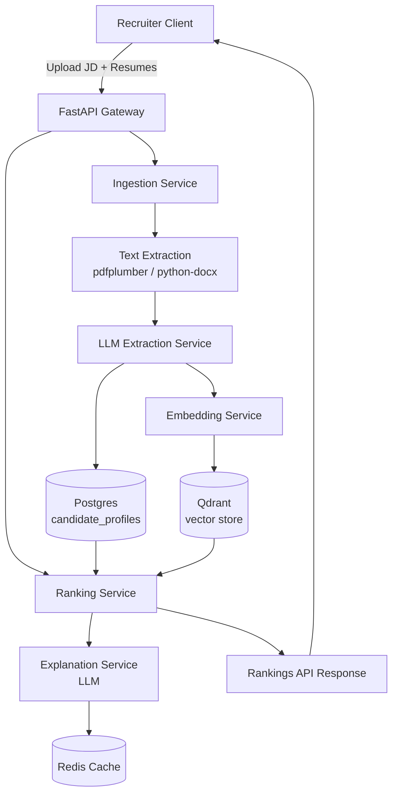

# Architecture — AI Resume Screening Platform

## 1. Goals & Non-Goals

**Goals**
- Rank candidates against a job description with defensible, explainable scores
- Keep ranking hybrid (semantic + rule-based) so it isn't a black box
- Be cheap to run at small/medium scale (Groq/Mistral over GPT-4-class models, managed free/low-cost tiers)
- Be production-shaped: auth, caching, evaluation, CI — not a notebook demo

**Non-goals**
- Not a full ATS/HRIS replacement (no interview scheduling, offer letters, etc.)
- Not attempting fully automated hire/reject decisions — output is a ranked shortlist with rationale for a human recruiter

---

## 2. High-Level Architecture



---

## 3. Component Responsibilities

| Component | Responsibility |
|---|---|
| Ingestion Service | accepts uploads, validates file type/size, stores raw file |
| Text Extraction | converts PDF/DOCX to plain text |
| LLM Extraction Service | converts raw text into a typed `CandidateProfile` via JSON-mode prompting |
| Embedding Service | embeds JD and candidate text, manages Qdrant upserts/queries |
| Ranking Service | combines semantic + rule-based signals into a final score |
| Explanation Service | generates and caches per-candidate rationale text |
| API Layer | request validation, auth, pagination, rate limiting |

---

## 4. Data Models (Pydantic)

```python
class CandidateProfile(BaseModel):
    candidate_id: UUID
    name: str
    skills: list[str]
    experience_years: float
    education: list[str]
    roles: list[str]
    certifications: list[str] = []

class JobPosting(BaseModel):
    job_id: UUID
    title: str
    description: str
    required_skills: list[str]
    nice_to_have_skills: list[str] = []
    min_experience_years: float

class RankingResult(BaseModel):
    candidate_id: UUID
    job_id: UUID
    semantic_score: float
    skill_overlap_score: float
    experience_fit_score: float
    final_score: float
    explanation: str
```

---

## 5. Database Schema

**Postgres (relational — source of truth)**

```sql
CREATE TABLE jobs (
    id UUID PRIMARY KEY,
    title TEXT NOT NULL,
    description TEXT NOT NULL,
    required_skills JSONB NOT NULL,
    nice_to_have_skills JSONB DEFAULT '[]',
    min_experience_years NUMERIC,
    created_at TIMESTAMPTZ DEFAULT now()
);

CREATE TABLE resumes (
    id UUID PRIMARY KEY,
    job_id UUID REFERENCES jobs(id),
    raw_text TEXT NOT NULL,
    file_path TEXT NOT NULL,
    created_at TIMESTAMPTZ DEFAULT now()
);

CREATE TABLE candidate_profiles (
    candidate_id UUID PRIMARY KEY,
    resume_id UUID REFERENCES resumes(id),
    profile JSONB NOT NULL,      -- validated CandidateProfile
    created_at TIMESTAMPTZ DEFAULT now()
);

CREATE TABLE rankings (
    job_id UUID REFERENCES jobs(id),
    candidate_id UUID REFERENCES candidate_profiles(candidate_id),
    semantic_score NUMERIC,
    skill_overlap_score NUMERIC,
    experience_fit_score NUMERIC,
    final_score NUMERIC,
    explanation TEXT,
    PRIMARY KEY (job_id, candidate_id)
);
```

**Qdrant (vector store)**

- Collection: `candidates`
- Vector size: matches chosen embedding model (e.g. 1024 for Mistral embed, 768 for smaller models)
- Distance: cosine
- Payload: `{candidate_id, job_id, skills[]}`  — used for metadata-filtered retrieval per job

---

## 6. Ranking Algorithm

```
final_score = w1 * semantic_score
            + w2 * skill_overlap_score
            + w3 * experience_fit_score
```

- **semantic_score** — cosine similarity between JD embedding and candidate profile embedding, normalized to [0,1]
- **skill_overlap_score** — `(matched_required * 2 + matched_nice_to_have) / (total_required * 2 + total_nice_to_have)`
- **experience_fit_score** — 1.0 if within required range, linear decay outside it (capped at 0)
- Default weights: `w1=0.5, w2=0.35, w3=0.15`, configurable per job via job settings

Weights are configurable rather than fixed so ranking behavior can be tuned per role type (e.g. skills-weighted for technical roles, experience-weighted for senior roles) without a code change.

---

## 7. LLM Prompting Strategy

**Extraction prompt**
- System instruction: "Extract only what is explicitly stated in the resume text; do not infer skills not mentioned."
- Enforce output via JSON schema / structured output mode
- On validation failure: retry once with the validation error appended to the prompt; on second failure, flag for manual review rather than silently dropping the candidate

**Explanation prompt**
- Input: JD text, candidate profile, score breakdown (not just the final number)
- Instruction: reference specific matched and missing skills/experience; avoid generic praise language
- Output cached in Redis to avoid regenerating identical explanations on repeated queries

---

## 8. Caching & Performance

- Redis caches: explanation text (keyed by profile hash), rate-limit counters
- Bulk resume processing runs as a background task (FastAPI `BackgroundTasks` initially; move to a queue like RQ/Celery if volume grows past a few hundred resumes per job)
- Embedding calls batched where the provider API supports it, to reduce request count

---

## 9. Security & Data Handling

- JWT auth on all write/upload endpoints; ranking read endpoints scoped to the job owner
- Resumes contain PII — stored files access-controlled, not publicly listable
- `DELETE /candidates/{id}` supports data-deletion requests
- Logs redact resume body content; only IDs and status codes logged

---

## 10. Observability

- Structured (JSON) logs with request-tracing IDs across ingestion → extraction → ranking
- Evaluation report (Phase 7) tracked over time to catch ranking-quality regressions
- Optional: Sentry or similar for error tracking in production

---

## 11. Scalability Considerations

- API layer is stateless — horizontally scalable behind a load balancer
- Qdrant and Postgres are the only stateful components; both support managed scaling (Qdrant Cloud, Neon)
- Bulk ingestion is the main load spike — background processing prevents blocking the API on large batches

---

## 12. Deployment Topology

```
Local:  Docker Compose (Postgres + Qdrant + Redis + API)
Prod:   API  -> Render/Railway/Fly.io
        DB   -> Neon (managed Postgres)
        Vector-> Qdrant Cloud
        Cache -> Upstash Redis
        CI   -> GitHub Actions (lint -> test -> eval-gate -> deploy)
```

---

## 13. Failure Modes & Mitigations

| Failure | Mitigation |
|---|---|
| LLM extraction fails/malformed JSON | schema-validated retry, then flag for manual review |
| LLM API timeout/rate limit | exponential backoff retry; fallback provider (Groq ↔ Mistral) |
| Qdrant unavailable | degrade to keyword/BM25-based skill matching only, mark result as "reduced confidence" |
| Duplicate resume upload | dedupe by file hash before re-processing |