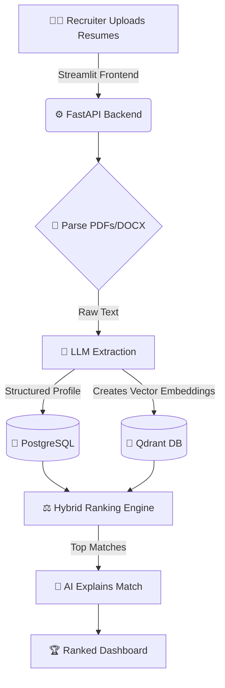

# AI Resume Screening Platform

A production-grade system that ranks candidates against a job description using **hybrid semantic + rule-based scoring**, with per-candidate LLM-generated match explanations. Built with FastAPI, Qdrant, and structured LLM extraction.

Unlike a single-resume "ATS checker," this platform is built the way real screening tools work: many resumes in, one ranked, explainable shortlist out.

---

## Features

- **Bulk ingestion** — upload a job description and a batch of resumes (PDF/DOCX)
- **LLM structured extraction** — resumes parsed into a typed candidate profile (skills, experience, education, roles)
- **Hybrid ranking** — semantic similarity (embeddings) blended with rule-based skill/experience matching
- **Explainable results** — each ranked candidate gets a short, evidence-based justification
- **Evaluation harness** — ranking quality measured against a labeled test set
- **Production Hardened** — JWT auth, Redis rate-limiting, comprehensive logging

---

## Architecture Overview

Here is a simplified look at how data flows through the system from the moment a recruiter uploads resumes to the final ranked output:



**The 3-Step Process:**
1. **Ingest & Extract:** Resumes are parsed, and a blazing-fast LLM extracts a structured JSON profile (years of experience, skills, etc.).
2. **Embed & Store:** That profile is converted into mathematical vectors and stored in Qdrant for semantic search, while the raw data sits in Postgres.
3. **Rank & Explain:** A hybrid algorithm scores candidates based on semantic meaning *and* hard rules (like minimum years of experience). Finally, an LLM writes a 2-sentence explanation of why they match.

---

## Tech Stack

| Layer | Technology | Why |
|---|---|---|
| API | FastAPI | Async, typed, fast to build and document |
| UI | Streamlit | Rapid frontend prototyping for data apps |
| Validation | Pydantic v2 | Strict schema enforcement for LLM outputs |
| Relational DB | PostgreSQL (Neon) | Core data storage for jobs, resumes, and profiles |
| Vector DB | Qdrant Cloud | Fast and scalable semantic candidate retrieval |
| LLM | Groq / Mistral API | Lightning-fast structured extraction & explanation generation |
| Cache & Auth | Redis (Upstash) | JWT caching and public endpoint rate throttling |
| Environments | uv | Fast, reproducible Python package management |
| Deployment | Render / Cloud | Fully containerized with Docker for seamless PaaS hosting |

---

## Project Structure

```text
resume-screening-platform/
├── app/
│   ├── main.py            # FastAPI application entrypoint
│   ├── core/              # JWT Security, Config, and Logging
│   ├── api/               # API Routers (jobs, resumes, rankings, auth)
│   ├── services/
│   │   ├── extraction.py  # Groq/Mistral extraction logic
│   │   ├── embedding.py   # Gemini embedding & Qdrant upsert
│   │   ├── ranking.py     # Hybrid scoring mathematics
│   │   └── explanation.py # LLM explanation generation
│   ├── models/            # SQLAlchemy database models
│   ├── schemas/           # Pydantic validation schemas
│   └── db/                # PostgreSQL Session management
├── docs/                  # Detailed Architectural Documentation
├── eval/                  # RAG evaluation scripts and labeled sets
├── tests/                 # Unit and Integration Tests (pytest)
├── docker/                # Dockerfiles for Prod and Local Compose
├── streamlit_app.py       # Frontend Application
└── pyproject.toml         # Python Dependencies (managed by uv)
```

---

## Documentation Reference

For a deep dive into the architecture, internals, and deployment of this platform, please refer to our comprehensive documentation:

| No | Module | Description |
|:---|:---|:---|
| 01 | [System Overview](docs/01_SYSTEM_OVERVIEW.md) | High-level vision, architecture, and end-to-end flow |
| 02 | [Ingestion Engine](docs/02_INGESTION_ENGINE.md) | Document parsing (PDF/DOCX) and data persistence |
| 03 | [Structured Extraction](docs/03_STRUCTURED_EXTRACTION.md) | LLM parsing into Pydantic profiles via Groq/Mistral |
| 04 | [Vector Embeddings](docs/04_VECTOR_EMBEDDINGS.md) | Gemini embeddings and Qdrant integration |
| 05 | [Hybrid Ranking](docs/05_HYBRID_RANKING.md) | The mathematical model for semantic + rule-based scoring |
| 06 | [Explanation Generation](docs/06_EXPLANATION_GENERATION.md) | Generating AI justifications with Redis caching |
| 07 | [Evaluation Harness](docs/07_EVALUATION_HARNESS.md) | Live eval pipeline, Spearman correlation, and metrics |
| 08 | [Security & Auth](docs/08_SECURITY_AND_AUTH.md) | JWT implementation and Redis-backed rate limiting |
| 09 | [Environment Variables](docs/09_ENVIRONMENT_VARIABLES.md) | Complete configuration reference and secrets |
| 10 | [Known Gotchas](docs/10_KNOWN_GOTCHAS.md) | Non-obvious bugs, architectural decisions, and limits |
| 11 | [Deployment Guide](docs/11_DEPLOYMENT_GUIDE.md) | Deploying to Render, Streamlit Cloud, Neon, and Qdrant |

---

## Quickstart

```bash
git clone https://github.com/NazmulHudaNabil/AI-Resume-Screening-Platform.git && cd resume-screening-platform
uv venv && source .venv/bin/activate
uv sync

cp .env.example .env   # fill in keys below

docker compose up -d   # postgres, qdrant, redis
uvicorn app.main:app --reload
```

## If you want to test my Live Url


- username:you_name
- password:admin


## Testing

```bash
pytest --cov=app tests/
```

## License
MIT
